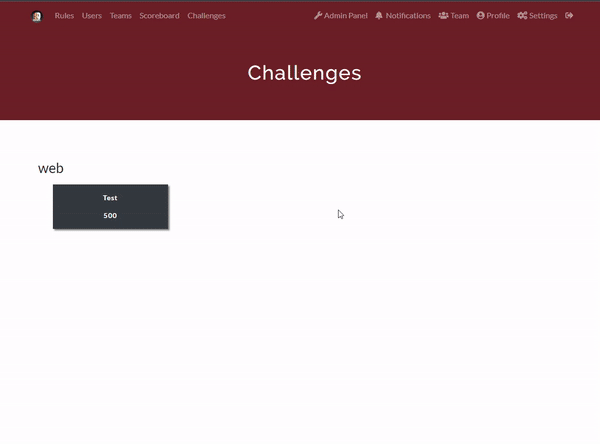

# CTFd Docker Containers Plugin

This is a modified version of CTFd Docker Containers Plugin by [andyjsmith](https://github.com/andyjsmith). The original version can be found here [andyjsmith/CTFd-Docker-Plugin](https://github.com/andyjsmith/CTFd-Docker-Plugin)

## Installation

Configure CTFd:
- Map docker socket into CTFd container by modifying the `docker-compose.yml` file:
```docker
services:
  ctfd:
    ...
    volumes:
    ...
      - /var/run/docker.sock:/var/run/docker.sock
    ...
```

Add plugin to CTFd:
- Clone this repository
- Rename "CTFd-Docker-Plugin" to "containers"
- Place `containers` folder inside `CTFd/plugins` directory

## Usage

*Note: Currently the plugin only works with team mode*

Connect to Docker daemon:
- If the CTFd and the challenges host in the same machine, you just need to go to the plugin page in admin page, click on `Settings`, on this page just fill in other fields except the `Base URL` field.


- If you host the CTFd and the challenges in different machines, you need to follow the instructions one that page

Create the challenge:

- Select container type and fill all the required fields


- If you want regular scoring for the challenge, set the maximum and minimum values to the same amount and the decay to zero.

- In the image field, it allows you to select the docker image already on the machine


## Some demo


