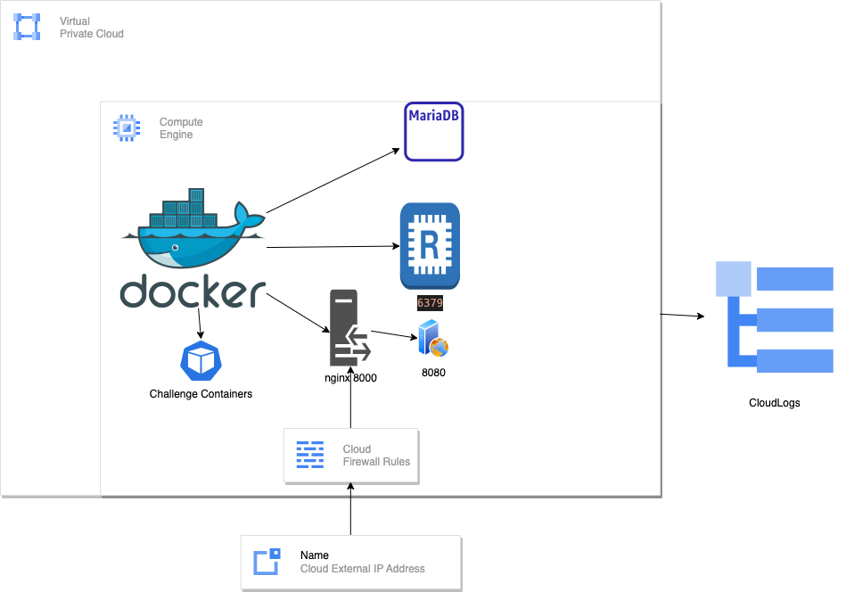

# NEU Team Solarwinds CTFd project

- [NEU Team Solarwinds CTFd project](#neu-team-solarwinds-ctfd-project)
  - [Terraform Setup](#terraform-setup)
    - [Google Cloud Shell](#google-cloud-shell)
    - [Individual Team Flags](#individual-team-flags)
  - [Credits](#credits)

## Terraform Setup

### Google Cloud Shell

```bash
git clone https://github.com/neu-solarwinds/CTFd-with-docker-plugin.git ## if private then need to use ssh and ssh keys
cd CTFd-with-docker-plugin
terraform init
terraform plan
terraform apply -auto-approve
```



## Individual Team Flags

Our requirement for this project was to create Individual / unique flags for each team. Usually in a CTF the flags are same for each challenge. Our target was for a particular challenge there will be **N** number of different flags for **N** teams. So this meant for a file related challenge - lets say Forensics pcap, we would need to create **N number of the same pcap** with the slight modification to account for the flag. 

We narrowed our scope to create individual flags for any **docker challenges**. For this we already use the docker-plugin to manage docker instances. 

### Normal flow

In a normal CTFd challenge addition , when admin adds the challenge description and flag (assuming single static flag) via the admin panel - 

1. First the challenge details go into the **challenges** table like the example below - 

| id | name  | description                   | connection_info | next_id | max_attempts | value | category           | type      | state  | requirements |
|----|-------|-------------------------------|-----------------|---------|--------------|-------|--------------------|-----------|--------|--------------|
| 1  | easy  |                               | @localhost      | NULL    | 0            | 1     | web                | container | visible| NULL         |
| 2  | hello | Hint: Find the strings of the binary. | NULL    | NULL    | 0            | 100   | Reverse Engineering | standard  | visible| NULL         |

2. The flag then goes into the **flags** table with reference to the challenge id - 

| id | challenge_id | type   | content        | data            |
|----|--------------|--------|----------------|-----------------|
| 1  | 1            | static | test           |                 |
| 2  | 2            | static | FLAG{aaaaaaaaaaaaa} |                 |

3. We can also add multiple flags for the same challenge such that any one of the flags count as the correct answer e.g. 

| id | challenge_id | type   | content        | data            |
|----|--------------|--------|----------------|-----------------|
| 1  | 1            | static | test           |                 |
| 2  | 2            | static | FLAG{aaaaaaaaaaaaa} |                 |
| 3  | 2            | static | FLAG{bbbbb}              |                  | 

In this case both flags - `FLAG{aaaaaaaaaaaaa}` and `FLAG{bbbbb}` are tied to challenge 2 and participants can submit either or. 

4. Without any plugin, we can create a **standard** or **dynamic** challenge type. With the docker-plugin we added, we can also create a **container** type challenge. (See the challenges table above type=container). The admin puts in the container details which you can find here (https://github.com/phannhat17/CTFd-Docker-Plugin). The details are added to the **container_challenge_model** table e.g. 

| id | image                        | port | command | volumes | ctype | initial | minimum | decay |
|----|------------------------------|------|---------|---------|-------|---------|---------|-------|
| 1  | vulnerables/web-dwa:latest   | 80   |         |         | web   | 1       | 1       | 1     |

5. When participants want to start the docker challenge from the front-end, the back-end looks up this table and starts the container specified by the **image** entry. In this case, the `vulnerables/web-dwa:latest` will be started on port 80 (internal docker port) and a random host port will be returned to the participant so that they can now connect to the challenge instance. The **id** here is the **challenge_id** to tie the container and challenge together. 

### Modified Flow

#### Part 1 - Creating and inserting the individual flags

We utilize 2 scripts to create and insert the unique flags to the **flags** table. 
1. `makecontainers.py` -> This script takes a directory as argument where all the challenges are stored. The challenges may be a docker challenge or a standard challenge. This script searches for `Dockerfile` and builds a container with the tag **<dirname:latest>**. For example, you have a **challenges** directory with 3 sub dirs **chal1, chal2, chal3**. chal1 and chal3 are docker challenges and have a Dockerfile in their own directory. Running this script `makecontainers.py ./challenges` will create 2 docker containers - **chal1:latest** and **chal3:latest**. chal2 will be skipped over. 
2. Launch CTFd , login as admin, create challenges. We can create container challenges using the plugin and select the relevant image for the challenge. Put a flag - can be anything (for consistency we put the flag.txt content for the challenge). At the end of this step the table contents should be similar to the normal flow i.e. **challenges table** will have the challenge detail, **flags** table will have the flag detail with the challenge_id, and **container_challenge_model** table will have the container details. 
3.  Run `genteamflags_batch_sqlite.py` **OR** `genteamflags_batch_mysql.py`. This depends on if we are using SQLite / MariaDB. If we run CTFd using Flask / Python, a sqlite database `ctfd.db` will be created under `CTFd/CTFd/ctfd.db`. For this case use the `sqlite.py`. If we use CTFd docker it uses MariaDB. For this case use the `mysql.py`. 
	
	First set the hardcoded variables - 
	
	For `sqlite`:
	```
	NUMOFTEAMS = 2
	DB_PATH = '/home/diptendu/Desktop/CY7900/ctfdtest.db'  # Modify this to your database path
	CONTAINERS_TABLE = "container_challenge_model"
	FLAG_TABLE = "flags"
	```
	
	For `mysql`:
	```
	 # Define MySQL connection parameters
	DB_HOST = 'localhost'  # or your MySQL server IP
	DB_USER = 'ctfd'  # your MySQL username
	DB_PASSWORD = 'ctfd'  # your MySQL password
	DB_DATABASE = 'ctfd'  # your MySQL database name
	
	NUMOFTEAMS = 2
	CONTAINERS_TABLE = "container_challenge_model"
	FLAG_TABLE = "flags"
	```

	Once these are set, run your chosen script. It takes 2 arguments first is the source repo of challenges (same as the argument for makecontainers.py) second is a target repo where TEAM based copies will be created with individual flag. For example - `genteamflags_batch_sqlite.py ./challenges ./teams` will first scan the challenges for `Dockerfile` and copy them based on TEAM# - 

		teams
		│
		├─ TEAM1
		│  ├─ chal1
		│  └─ chal3
		│
		└─ TEAM2
		   ├─ chal1
		   └─ chal3

	
	Each of the challenges will have an updated `flag.txt` file with the new content as `baseflag + 8 random characters` e.g. if /challenges/chal1/flag.txt was `flag{check}` /teams/TEAM1/chal1/flag.txt will have `flag{check_$$$$$$$$}` where `$` is a random char `[A-Za-z0-9]`. Same with TEAM2, .. and so on. 

	The script will now build the containers and tag them as **<dirname:TEAM#>** e.g. **chal1:TEAM1** , **chal1:TEAM2** and so on. Finally it inserts the new flag into the **flags** table with the content and add this text **"TEAMID=#"** in the **data** column. This comes later when we check the submissions. After this step the flags table looks like this: 

	| id | challenge_id | type   | content   | data      |
	|----|--------------|--------|-----------|-----------|
	| 1  | 1            | static | flag{test_1} | TEAMID=1  |
	| 2  | 1            | static | flag{test_2} | TEAMID=2 |

#### Part 2: Checking the submission

1. We edited the `__init__.py` in the containers plugin. 
	[](https://postimg.cc/4nnRW3wM) 

The `TEAM_INDIVIDUAL_FLAGS=True` controls how the plugin will behave. When True it will look up the `container_challenge_model` table for the image, this will contain a name like - `<name:latest>`. We get the team id from the request and start `<name:TEAM#>`. So each team starts their pre-built container. 

3. Next change is in the `challenges.py` in `/api/v1`. 
	[](https://postimg.cc/YL7nKbYb)
	
 When participants submit an answer the api now takes into account the team id of the request. 
	
3.  Next we updated the `__init__.py` in `/plugins/challenges`. 
	[](https://postimg.cc/jCX0q72L)

Here for the challenge submitted we first check for flags and the content of the **data** column. If that contains the keyword **"TEAMID"** we infer that it is a individual team flag and send the flag checking logic to the new **compareteams** function. If the data column is empty - for a standard challenge we sent to the normal **compare**  function. 
	
4.  Added the new method **compareteams** in `/plugins/flags/__init__.py`:
	[](https://postimg.cc/gn1P1PrD)

Here we can check the flag. Also we log the case if one team submits another team's flag (flag sharing).

#### Turn off individual flag

Do not run scripts. Change the `TEAM_INDIVIDUAL_FLAGS=True` to `False` in `/plugins/containers/__init__.py`. Falls back to standard mode with / without container plugin. 

**Note**: This is not scalable if you have hundreds of teams like picoCTF but for a low-mid size CTF with around 30-40 teams should be fine. We have not tested with a large number of teams. 


## Credits

<https://github.com/CTFd/CTFd>

<https://github.com/phannhat17/CTFd-Docker-Plugin>
